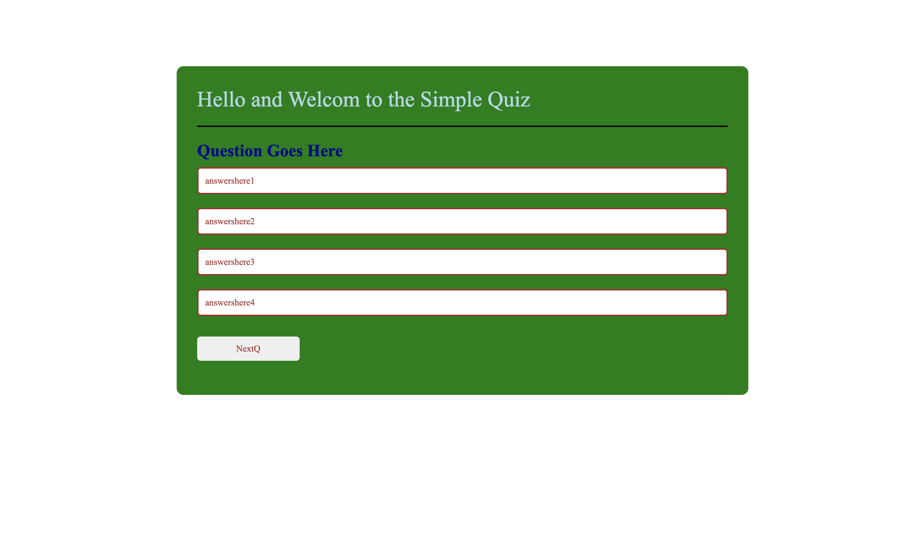
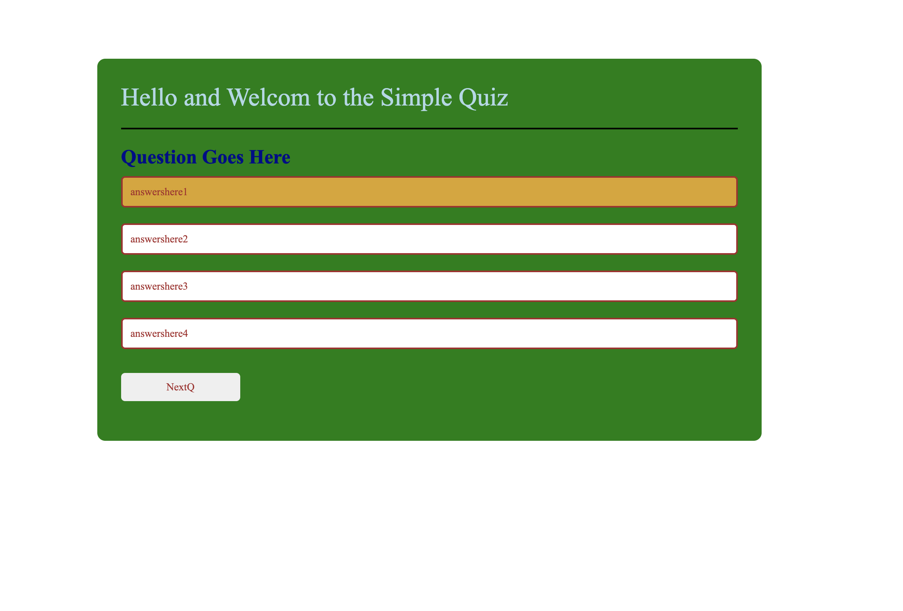

# Simple Quiz

The basic premise of this project was to be able to diplay a simple quiz game where you have a title, and a start button. From there, you would have a timer that counts down, and the first question. The timer is now going, and will continue to decriment until it hits zero as you answer questions. The good thing is, if you get correct answers, the timer will pause breifly and you will continue until a certain number of questions is given. The time left over is your score.

## The Story

This is where it gets hairy, being able to present the questions and answer back to the web page was a difficult process to understand for me. I read many times, tried out the examples, and still having issues with concept to paper to project. What I was able to present was merely a front page of what it would look like, and some question/anwer code underneith that would give most of the presentation to console.log for now until I can understand better queryselectors and getelementbyid, along with updating the pointers within the page. .. perhaps later.


## Developering the project. 

I got stuck, like right away, and barely got past the css and presentation. Just nothing was working for me and no code to get answers and answer them was given. This is my fault for sure. 


## How the program will work

<h2>Here we have the layout as the browser sees it</h2>




<h2>Same view but with a button highlighted as if to be selected</h>



<h2> And finally, here's the snippet of the index.html ... mostly simple.

```html
<body>
<div class="itBegins">
    <h1> Hello and Welcom to the Simple Quiz</h1>
    <div class="putQHere">
        <h2 class="questionH2">Question Goes Here</h2>
        <div class="ansButtons">
            <button class="button">answershere1</button>
            <button class="button">answershere2</button>
            <button class="button">answershere3</button>
            <button class="button">answershere4</button>
        </div>
        <button class="nextButton">NextQ</button>
    </div>

    <div class="correctAnsDiv">
        <h2 class="correctAnsH2"></h2>
    </div>
</div>```


## Thoughts on this project

Looking back, if I had at least completed the javascript to answer the questions, it would have been a success to me as it would not take much more time to get the help needed to present the answers into the web-page. Will do that next time to complete what I can/know first and unblock self with help.

## Where to find this code and website
| Links to Code        | Resource URL           |
| ------------- |:-------------:|
| Simple Quiz Run Page   | [https://flimits.github.io/simple_quiz/](https://flimits.github.io/simple_quiz/) |
| GitHub Repo | [https://github.com/flimits/simple_quiz](https://github.com/flimits/simple_quiz)     |

## Some Technologies Relyed upon to complete this task
| Technology Used         | Resource URL           |
| ------------- |:-------------:|
| CSS W3School for functions    | [https://www.w3schools.com/css](https://www.w3schools.com/css)      |
| Mozilla Web docs for functions | [https://developer.mozilla.org/](https://developer.mozilla.org/en-US/docs/Web/JavaScript/Reference/Global_Objects/Math/floor)
| GitHub | [https://github.com/](https://github.com/)     |
| Youtube University | [https://youtube.com/](https://youtube.com/)     |
| Docs from Class | Hitting the class notes and materials and drills    |


## My Pseudo code used when creating the code to create this program.

****

- There will be a web page with a title.
- There will be a an area for the question and several buttons with answers to choose from.
- you will need variales to store
   - Your score: wons and losses
   - The counter
   - Presenting the questions
   - presenting the answer and storing correct one.
   - creating local storage so answers can be persistant on refresh
- A timer will need to be running as soon as a start button is clicked.
- Present the first question.
- Compare the answer with the questions presented, and decided if the answer is true or false.
- Save that score off and present it to the screen.
- If the answer is correct, add some time to the timer (or pause it if possible).
- Keep asking questions until you run out of them or the timer hits zero.
- Your final score will be the time left on the timer.